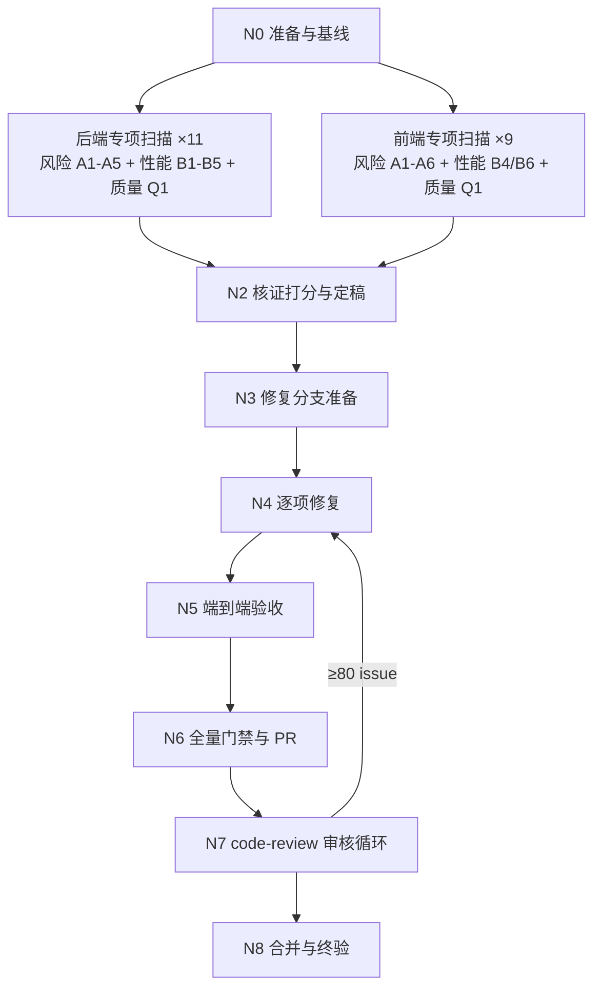

# 项目风险扫描 · 交付graph执行设计

> 本文档为唯一执行依据。执行者必须按节点依赖（N0→N8）推进，所有循环仅在满足对应退出条件后方可进入下一节点；**全任务仅在「第五章 DoD」全部满足后才允许退出主循环**。
> 根定位层 `AGENTS.md`（含 app/web/admin 三份子宪法）与全局规范 `~/.zcode/AGENTS.md` 为本任务最高约束，任何产出与之冲突即判定不合格。

## 0. 执行框架总览

### 0.1 目标

对**全仓库代码**（扫描基线 = 执行时 dev HEAD 提交态，排除清单见 N0）做三路专项扫描——A 类高置信风险（运行错误、数据丢失、权限绕过、宪法不符、资源泄漏、跨端兼容）、B 类 IO/DB 性能优化、代码质量优化（code-simplifier 插件）——前后端分组、每职责一个专职 subagent，产出两份带证据与置信度的报告；对核证通过项逐项修复（**业务保持优先、零破坏性变更**），经端到端验收（100% 覆盖全部修改项）与 PR + code-review 插件审核后合入 dev。

### 0.2 主控循环（Master Graph）

```text
初始化进度文件（N0）
while DoD 未全部满足:
    定位当前节点（依据进度文件）
    N1 二十路专项扫描并行派遣（后端 11 专项 + 前端 9 专项，互不依赖，同时发出）
    汇合 N2：核证打分 → 定稿两份报告与修复清单
    N3：worktree 修复分支准备
    N4：逐项修复（串行，内含修复循环；业务保持优先）
    N5：端到端验收（覆盖矩阵 100% 覆盖全部修改项，内含验收循环）
    N6：分支全量门禁 → push → PR → CI
    N7：code-review 插件审核循环
    N8：合并 → 删分支/删 worktree → 终验
    每节点出口门禁通过才推进；未通过走回退边或节点内修复循环；超限升级用户
DoD 全满足 → 终验报告 → 退出
```

### 0.3 产物索引

| 产物 | 路径 | 入库约定 |
| --- | --- | --- |
| 执行进度文件 | `docs/progress/2026-09-05-项目风险扫描-progress.md` | 提交 git |
| 扫描候选分片 ×20 | A 类 `docs/bugs/2026-09-05-scan-{be,fe}-a1~a6-*.md` 共 11 片；B/Q 类 `docs/pref/2026-09-05-scan-{be,fe}-b*/q*.md` 共 9 片（编号对应 1.3 节专项表） | 本地留存（gitignored），N2 定稿后删除 |
| A 类问题清单 | `docs/bugs/2026-09-05-全仓高风险问题清单.md` | 本地留存不入库（`.gitignore` L56） |
| B 类优化清单（含代码质量优化章节） | `docs/pref/2026-09-05-全仓IO性能与代码质量优化清单.md` | 本地留存不入库（`.gitignore` L57） |
| 修复提交 | `fix/risk-scan-2026-09-05` 分支（一问题一提交） | 推送远端 |
| 端到端验收记录 | `docs/progress/2026-09-05-项目风险扫描-e2e验收.md`（覆盖矩阵 + 逐场景证据） | 提交 git |
| PR | `fix/risk-scan-2026-09-05` → `dev` | 合并后分支删除 |
| 终验报告 | `docs/progress/2026-09-05-项目风险扫描-终验.md` | 提交 git |

※ `docs/bugs/`、`docs/pref/` 被仓库 `.gitignore` 收窄排除，两份报告落盘即可，禁止强行 `git add -f`；进度/终验/e2e 记录属 `docs/progress/` 任务产物目录，必须提交。

### 0.4 阶段门禁总表

| 节点 | 名称 | 核心产物 | 出口门禁（一句话） |
| --- | --- | --- | --- |
| N0 | 准备与基线 | 进度文件 + 基线 hash + 排除清单 | 扫描基线钉死；排除清单（未提交文件/非代码目录）落盘 |
| N1 | 二十路专项并行扫描 | 候选分片清单 ×20 | 每专项确定扫描项逐项有检查记录、每候选附「文件:行 + 代码片段 + 触发条件与影响」要素 |
| N2 | 核证打分与定稿 | 两份正式报告 + 修复清单 | 每候选有 0-100 置信度与核验结论；≥80 项修复方案含影响面与兼容性说明；分片清理 |
| N3 | 修复分支准备 | worktree + fix 分支 | 分支基于 N3 时点 dev HEAD；主工作区与 N0 快照逐字一致 |
| N4 | 逐项修复 | 修复提交 ×N | 修复清单 100% 完成；一问题一提交；每项含测试变更；diff 零破坏性变更 |
| N5 | 端到端验收 | e2e 验收记录 | 覆盖矩阵 100% 覆盖全部修复项；全部场景通过 |
| N6 | 门禁与 PR | PR | 三端全量门禁绿（输出附进度文件）；PR 创建成功且 CI 三 job 绿 |
| N7 | PR 审核 | code-review 报告（PR 评论） | 无 ≥80 issue；CI 保持绿 |
| N8 | 合并与终验 | 终验报告 | PR 已合并；fix 分支与 worktree 已删；dev CI 绿；DoD 全勾 |

### 0.5 节点依赖图



**并行分支**：N1 二十路专项互不依赖同时派遣（后端 11、前端 9，每专项一个专职 subagent）；N2 汇合门禁要求二十片全部到达。
**汇合门禁**：N2 要求每候选均有独立核证结论（核证专员 ≠ 对应专项扫描专员）；**证据无法核实的候选不回流重扫**，由核证专员只读自查独立取证后按 rubric 低分定级，并入报告对应节呈报。
**回退边**：N5 场景失败 → 回 N4 修复后重验；N7 发现 ≥80 issue → 回 N4 增量修复后重走 N5~N7。

### 0.6 并行会话注意（本工作区实测约束）

1. **主工作区存在并行会话未提交改动**（`git status` 实测：dev 上 admin 模型注册域重排多文件未提交）。扫描与核证全程只读，禁止 checkout / 切分支 / stash / 改工作区；修复一律在 `.worktrees/` 下新建 worktree 进行（该目录已被 `.gitignore` L85 收编）。
2. 派遣前主控以 `git status --porcelain` 快照存进度文件；N3 与 N8 各校验一次主工作区与快照一致，不一致立即停手升级用户。
3. dev HEAD 可能被并行会话推进：扫描基线以 N0 实取 hash 为准并在派遣指令中下发；N3 分支基于 N3 时点实取 dev HEAD，若 N6 时 dev 已前移，由 PR 阶段处理冲突，禁止对主工作区做任何 rebase/reset。
4. worktree 与主目录共享本地中间件库，跑测试/迁移前核对 alembic 版本对齐（`7909811` 提交在 `scripts/dev_up.py` 内置了 `Can't locate revision` 时的 `stamp --purge` 指路），异常时停手按指路处理或升级用户。
5. **未提交改动所涉文件整文件排除出本次扫描**（N0 排除清单；扫描分支上不存在这些改动，修复无法落点），登记进度文件，终验报告呈报「待并行会话合入后另行补扫」。
6. e2e 与修复全栈需占用 5433/6380/8001/3000/3001 等端口；主工作区同端口服务在跑时**升级用户协调，禁擅杀非本任务进程**。

---

## 1. 任务范围定义

### 1.1 范围内（In Scope）

1. **全仓库扫描**（范围与排除清单见 N0）：
   - A 类风险专项 ×11（后端 5 + 前端 6）：运行错误、数据丢失、权限绕过、宪法规范（全局 §一注释/§二日志/§四测试与死代码 + 对应子宪法）、资源泄漏、跨端兼容；
   - B 类性能专项 ×7（后端 5 + 前端 2）：DB 查询、缓存（附一致性维护方案）、异步化、文件传输与 IO、高并发原子化（Lua/CAS）、前端网络传输、前端渲染与包体；
   - 代码质量专项 ×2（后端/前端各一，code-simplifier 插件子代理只读扫描）。
   - 各专项的**确定扫描项清单**以 N1 节内表格为准，禁止泛化扫描。
2. 两份正式报告落盘（0.3 节路径；B 类报告含「性能优化」与「代码质量优化」两章），每项附证据、0-100 置信度、状态列。
3. 核证打分：按 code-review 插件 rubric 逐项独立核证（第 4 章派遣规范）。
4. 置信度 ≥80 的问题/优化项逐项修复：新开 `fix/risk-scan-2026-09-05` 分支，一问题一提交，测试与实现同提交，**业务保持优先、零破坏性变更**。
5. **端到端验收**：建立修复项 → e2e 场景覆盖矩阵，100% 覆盖全部修改项且全部通过（code-review 前置门禁）。
6. PR → `dev`，按 code-review 插件全流程审核，通过后合并并删除 fix 分支。

### 1.2 范围外（Out of Scope）

1. 主工作区未提交改动所涉文件（N0 排除清单）：属并行会话待验看内容，本次不扫，待其合入后另行补扫。
2. 模糊不确定的优化项与语义争议项：只入报告「待裁决」节呈报用户，不动代码。
3. `docs/`、spec、宪法文档的内容审查（非代码对象）。
4. 新功能与大规模重构；代码质量修复以行为保持的最小简化为限，禁借质量专项做结构重构。
5. 需要外部厂商凭证的真机 smoke 验证。
6. 依赖升级与 alembic 表结构新设计。
7. **破坏性变更**（API 契约/DB schema/配置格式/公共组件契约）——除非该候选本身修复的正是破坏既有功能的缺陷，且方案经 N2 影响面评估通过。

### 1.3 任务划分与拆分依据（需求模式）

| 端组 | 专项（编号） | 专职 subagent | 并行性判定 |
| --- | --- | --- | --- |
| 后端（`app/` `alembic/` `tests/` `scripts/` + 根配置） | A1 运行错误 / A2 数据丢失 / A3 权限绕过 / A4 宪法规范 / A5 资源泄漏 | 专项扫描专员 ×5 | 二十专项互不依赖，全部并行 |
| 后端 | B1 DB 查询 / B2 缓存 / B3 异步化 / B4 文件传输与 IO / B5 高并发原子化 | 专项扫描专员 ×5 | 同上 |
| 后端 | Q1 代码质量 | code-simplifier 子代理 ×1 | 同上 |
| 前端（`web/` + `admin/`） | A1 运行错误 / A2 数据丢失 / A3 权限绕过 / A4 宪法规范 / A5 资源泄漏 / A6 跨端兼容 | 专项扫描专员 ×6 | 同上 |
| 前端 | B4 网络传输 / B6 渲染与包体 | 专项扫描专员 ×2 | 同上 |
| 前端 | Q1 代码质量 | code-simplifier 子代理 ×1 | 同上 |
| 汇合 | 候选核证打分（按端组分片） | 核证专员并行 | 依赖 N1 二十片全部到达 |
| 收口 | 逐项修复 → e2e 验收 → 门禁 PR → 审核 → 合并 | 实现专员串行 + 审核专员 | 依赖 N2 定稿 |

拆分依据（用户 2026-09-05 两轮裁决）：①扫描以**「端组 × 职责专项」为粒度**——前后端分别审查不笼统合入，每项职责一个专职 subagent 对全仓只按本职责判据过筛；②各专项职责**落地为确定扫描项清单**（N1 节表格，前端专项逐条枚举），禁泛化描述；③代码质量专项由 code-simplifier 插件子代理承担。核证独立于扫描（禁自我审核）；修复共用单分支故串行；e2e 验收与审核为合入前置门禁。

---

## 2. 全局执行总则

1. **阶段门禁制**：未满足出口门禁禁止进入下一节点；回退记录进进度文件。
2. **信息获取决策链**（严格按优先级，不得跳级）：L1 项目内部（源码、三份 AGENTS.md、已有测试、git 历史）→ L2 外部（官方文档）→ L3 用户决策（一次性汇总：背景、可选项、建议方案）；每次触发 L2/L3 记入进度文件「决策日志」。
3. **循环收敛**：所有修复类循环设最大迭代次数，超限升级用户，禁止无限循环或静默放弃。
4. **单一事实源**：本执行文档与 N2 定稿报告为修复唯一依据；实现中发现报告缺陷必须先回改报告再继续。
5. **状态续传**：每完成一个候选/一项修复/一道门禁立即更新进度文件（含派遣日志）；会话中断后从进度文件恢复。
6. **可验证完成**：任何「完成」声明附证据（命令输出、文件路径、commit hash、e2e 记录）。
7. **subagent 执行制**：扫描（调研）、修复（实现）、核证与 PR 审核（审核）一律派遣 subagent；主控仅编排（进度、门禁判定、派遣协调、升级决策）。
8. **业务保持优先（用户硬约束）**：必须确保现有业务功能实现正确，任何修复不得破坏已有业务功能设计；性能与质量类修复必须行为保持；语义争议候选一律转「待裁决」呈报，禁直接修；禁引入破坏性代码变更（API 契约/DB schema/配置格式/公共组件契约）。
9. **只读纪律**：N0~N2 阶段主控与全部 subagent 对仓库零写入（报告文件除外），禁改代码/配置/依赖/分支。

---

## 3. 阶段详细定义

### N0 准备与基线

**依赖节点**：无

**步骤**：

1. 实取扫描基线：`git rev-parse HEAD` 记录为基线 hash → 全仓扫描范围为该提交态的 tracked 文件 → 验证：hash 与实取时间写入进度文件。
2. 构建排除清单并存进度文件：
   - (a) `git status --porcelain` 所列**未提交改动文件整文件排除**（并行会话保护，登记「待补扫」）；
   - (b) 非代码内容：`docs/` 全目录、构建产物（`**/node_modules/`、`**/.next/`、`**/dist/`、coverage）、框架生成文件（如 `next-env.d.ts`）——`git ls-files` 天然排除未跟踪与 gitignore 项，清单按前缀过滤生成 → 验证：排除清单落盘且 (a) 非空时显眼标注。
3. 创建进度文件（派遣日志、决策日志、门禁状态、修复清单状态表、e2e 覆盖矩阵五固定节）→ 验证：文件落盘且五节齐备。

**核心产物**：`docs/progress/2026-09-05-项目风险扫描-progress.md`

**出口门禁**：

- [ ] 扫描基线 hash 钉死记录
- [ ] 排除清单落盘（未提交文件 + 非代码目录）
- [ ] 进度文件五节齐备

### N1 二十路专项并行扫描

**依赖节点**：N0（并行起点，二十路互不依赖）

**输入**：进度文件中的基线 hash 与排除清单；各专项**确定扫描项清单**（下表，判据均源自第八章宪法与全局规范对应条款）。候选 ID 编码 `<端组>-<专项>-<序号>`（如 `BE-A3-02`）。

**后端专项组 ×11**（扫描范围：排除清单过滤后的 `app/` `alembic/` `tests/` `scripts/` + 根配置；判据：`app/AGENTS.md` + 全局 §一§二§四）：

| 专项 | 确定扫描项 |
| --- | --- |
| BE-A1 运行错误 | ①异常路径：裸 except/吞异常、未处理 None 与空容器、除零/越界/键缺失；②async 误用：AsyncSession 跨任务并发共享、事件循环内阻塞调用、派生任务无异常观察；③状态机：非法迁移路径、CAS 分支遗漏、失败分支未回滚；④数据口径：时区与 naive datetime 混用、int8 大整数精度、枚举与魔数不一致；⑤序列化：Pydantic 响应模型与实际返回不一致、可空字段未判 |
| BE-A2 数据丢失 | ①写操作事务缺失（无 commit/异常无 rollback/部分提交）；②更新丢字段（整行覆盖式 update）与并发丢更新（无乐观锁/版本条件）；③级联删除副作用（cascade/ondelete 与业务预期不符）；④迁移风险：丢列/改列类型/缩窄约束/revision 断链；⑤软删漏接线（查询未过滤 deleted、唯一索引未含软删语义） |
| BE-A3 权限绕过 | ①IDOR：资源端点缺归属/成员校验；②管理端点混入普通路由、权限装饰器缺失、角色判断颠倒；③响应体敏感字段泄露（密钥/哈希/token/他人数据）；④未鉴权新端点、会话与令牌校验旁路 |
| BE-A4 宪法规范 | ①§一注释：类/模块/公开方法缺业务注释，关键逻辑（状态变更/金额/权限/DB/缓存/并发/重试/三方调用）缺行级注释，纯翻译型注释；②§二日志：写操作/三方调用/异常无日志、日志含敏感信息、循环刷日志；③§四测试与死代码：废弃函数/未引用 import/注释掉的代码/空实现桩/失效测试残留、改动无对应测试；④app 宪法：分层依赖越界、参数超 3 个未对象化、裸 dict 返回、响应模型缺失、目录与命名违规 |
| BE-A5 资源泄漏 | ①DB 会话/连接未关闭（上下文管理器缺失）；②httpx 客户端未复用或未 aclose、响应流未关闭；③临时文件异常路径未清理、MinIO 流未释放；④asyncio 任务未 await/未 cancel、线程池未关闭 |
| BE-B1 DB 查询 | ①N+1：循环内逐条查询 → 批量 IN/join/selectinload；②独立 COUNT + 列表双查询 → COUNT OVER 窗口合并；③缺失索引：高频 where/join/order by 列；④过度取数：全行投影 vs 薄投影、无分页全量拉取；⑤深分页 OFFSET 退化 |
| BE-B2 缓存 | ①高频读热点无缓存（配置/注册表/目录类稳态数据）；②进程内快照缓存机会（含失效机制）；③Redis 适用场景（跨进程共享读）；**每项必须附一致性维护方案**（失效时机/TTL/写后失效/版本戳） |
| BE-B3 异步化 | ①事件循环内 CPU 密集（PIL/图像处理）未转线程池；②事件循环内阻塞 IO（同步文件/同步请求）；③可并行的串行 await 链 → gather；④长耗时任务应入 worker/队列而非请求内联 |
| BE-B4 文件传输与 IO | ①MinIO：全量读入内存 vs 流式、上传下载未并发化、缺超时；②httpx：无超时、每请求新建客户端、未设重试；③ffmpeg/媒体管线串行可并行、临时产物清理；④大文件无分片/流式处理 |
| BE-B5 高并发原子化 | ①检查-后-行动竞态（先读后写无原子保证）；②余额/计数扣减未用条件 UPDATE；③状态流转未用 CAS（UPDATE ... WHERE status=期望）；④Redis 多步操作可 Lua 脚本原子化（限流/计数/去重） |
| BE-Q1 代码质量 | 由 **code-simplifier 插件子代理**执行（见第 4 章）：重复逻辑可归并、过深嵌套与过长函数、命名与业务不符、冗余抽象与死抽象、可读性；**只提行为保持类简化建议**，行为变更类发现转交对应 A 专项 |

**前端专项组 ×9**（扫描范围：排除清单过滤后的 `web/` + `admin/`，发现须标注所属端；判据：`web/AGENTS.md` + `admin/AGENTS.md` + 全局 §一§二§四）：

| 专项 | 确定扫描项 |
| --- | --- |
| FE-A1 运行错误 | ①未捕获 Promise rejection（async 事件处理器无 try/catch、无错误边界）；②useEffect 竞态：异步回调后 setState 未取消（AbortController/标志位缺失）、依赖数组错漏、清理函数缺失；③卸载后 setState / 回调引用已卸载组件；④空值链：可选链缺失、find 结果未判空、数组空判断缺失；⑤hydration 不匹配（随机值/时间直渲染、SSR/CSR 差异）；⑥大整数 ID 走 Number() 精度丢失；⑦key 不稳定（index key 引发状态错乱） |
| FE-A2 数据丢失 | ①表单/编辑态路由切换或弹窗关闭丢失（无草稿持久化、无确认拦截）；②乐观更新失败回滚缺失；③并发写覆盖（后到请求覆盖用户输入）；④localStorage/sessionStorage 读写无异常兜底（隐私模式/配额满）；⑤删除/覆盖操作无确认或不可恢复提示 |
| FE-A3 权限绕过 | ①敏感操作入口显隐判断错误（角色条件写反/漏判）；②仅前端守卫而服务端动作无二次校验的调用链（登记后端侧由 BE-A3 归口）；③token/凭证处理：未携带、落日志、落 console、存非约定位置；④错误信息渲染内部细节（堆栈/SQL/内网地址） |
| FE-A4 宪法规范 | ①双端宪法 C 章：React Query 独享服务端数据（手写 fetch+useState 反模式）、禁 rewrites 代理、令牌跨端隔离；②动效纪律 C.5.5（motion 优先/reduced-motion/transform+opacity 两纪律）；③§一注释、§四死代码（未引用组件/hooks/工具/样式、未用 import）；④TS：裸 any、无依据类型断言、API 响应未类型化；⑤业务对象契约 A.7（请求参数对象化、跨业务类型不复用） |
| FE-A5 资源泄漏 | ①addEventListener 未 remove（尤其 document/window 级与 capture 链）；②setInterval/setTimeout 未清理（含防抖节流定时器）；③IntersectionObserver/ResizeObserver/MutationObserver 未 disconnect；④SSE/WebSocket 订阅未关闭、重连定时器泄漏；⑤无上限闭包缓存驻留、Canvas/媒体流未释放 |
| FE-A6 跨端兼容 | ①API 响应类型与后端 schema 对齐（字段名/可空性/枚举值）；②错误码处理链完整（401/402/409/422 逐码有归宿）；③分页契约（页码/页大小/总数口径）与时间格式解析；④CORS/端口约定（3000/3001、直连 `NEXT_PUBLIC_API_BASE_URL`、禁 rewrites）；⑤双端令牌隔离不被破坏 |
| FE-B4 网络传输 | ①重复请求：同 key 并发去重缺失、组件重复挂载重复拉取；②串行 await 可并行（Promise.all 机会）；③该分页的全量拉取、高频输入缺防抖；④轮询无退避/无终止条件 |
| FE-B6 渲染与包体 | ①React Query 缓存策略（staleTime/gcTime/失效粒度不当致冗余请求）；②大列表无虚拟化或分页、大计算无 memo/useMemo；③大依赖未动态导入、重复依赖；④图片资源未优化（尺寸/懒加载） |
| FE-Q1 代码质量 | 由 **code-simplifier 插件子代理**执行（同 BE-Q1 口径），范围为 `web/` + `admin/` |

**步骤**（每专项同构，单一职责到底）：

1. `git ls-files` 按 N0 排除清单过滤得全仓扫描文件清单 → 验证：清单覆盖全部入扫文件。
2. 逐文件对照本专项「确定扫描项」逐条过筛（只查本职责，不越界）→ 验证：扫描项逐条有「已检查」记录。
3. 每个候选写入本专项分片文件，必含：ID（如 `BE-A3-02`）/ 端 / 严重级别（B/Q 类为收益级别）/ `文件:行` / 现行代码片段 / 触发条件与影响（B/Q 类附优化方案与一致性/风险说明；能定位引入提交时附 hash） → 验证：要素（位置+片段+影响）缺一不收。
4. 与其它专项明显重叠的候选照常记录，跨片去重归 N2 汇总时处理。

**核心产物**：二十份专项分片清单（0.3 节路径）

**出口门禁**：

- [ ] 二十专项全部分片产出，各专项确定扫描项逐条有检查记录
- [ ] 每候选要素齐备，无凭印象候选
- [ ] 分片按 0.3 节命名约定落盘

### N2 核证打分与定稿

**依赖节点**：N1 二十路专项（汇合点，二十片全部到达）

**输入**：二十份专项分片清单；code-review 插件原文（第八章路径）。

**步骤**：

1. 主控汇总二十片候选，**跨片去重**（A4 §四死代码与 Q 专项重叠项合并、同文件同类发现归并）→ 验证：去重记录入进度文件。
2. 并行派遣核证专员（**按端组分片：后端候选归后端核证片、前端候选归前端核证片**；每片独立，禁止与产出该候选的专项扫描专员同人）：**派遣指令必须先读插件原文** `commands/code-review.md`，按其第 5 步 rubric 原文逐项打 0-100 置信度，并按其假阳性清单核验——其中「pre-existing」一条因全仓扫描**不再适用**（存量即在范围内），其余照用（linter 可拦截、nitpick、疑似但未证实、已显式 silence 等）；核证专员**只读自查独立取证**——自行以 `git log`/`git diff`/读码回溯验证候选要素，不回炉原扫描专员补证；每项输出核验结论 + 评分 + 理由 → 验证：每候选一项结论，无跳项。
3. **证据无法核实的候选不回流重扫**：直接按 rubric 低分定级，归入「低置信观察」或「证据不足」节呈报 → 验证：低分项分级归宿有记录。
4. 主控定稿两份正式报告：≥80 项进「修复清单」，**每项附修复方案概要 + 影响面与兼容性说明**（触及 API 契约/DB schema/配置格式/公共组件契约者显式标注破坏性风险）；50~79 项入「低置信观察」节；<50 剔除；模糊优化项与语义争议项入「待裁决」节呈报用户；B 类报告分「性能优化」「代码质量优化」两章 → 验证：报告结构与分级齐全，每项有状态列。
5. 删除二十份分片文件（内容已并入定稿）→ 验证：分片文件不存在。

**核心产物**：`docs/bugs/2026-09-05-全仓高风险问题清单.md`、`docs/pref/2026-09-05-全仓IO性能与代码质量优化清单.md`（报告内含修复清单节）

**出口门禁**：

- [ ] 每候选有独立核证结论与 0-100 评分
- [ ] 两份正式报告落盘且分级（修复清单/低置信观察与证据不足/待裁决）齐全
- [ ] 修复清单每项方案概要与影响面说明明确
- [ ] 分片文件已清理

### N3 修复分支准备

**依赖节点**：N2

**步骤**：

1. `git worktree add .worktrees/fix-risk-scan-2026-09-05 -b fix/risk-scan-2026-09-05 <N3时点dev HEAD>` → 验证：`git worktree list` 含新条目，分支基于实取 hash。
2. worktree 内装依赖：`uv sync --dev` + `web`/`admin` 各 `npm ci` → 验证：三端依赖安装成功输出。
3. 核对主工作区：`git status --porcelain` 与 N0 快照一致 → 验证：逐字一致（不一致停手升级）。
4. 核对 alembic 版本状态（0.6 第 4 条）→ 验证：无 `Can't locate revision` 类异常。

**核心产物**：worktree + `fix/risk-scan-2026-09-05` 分支

**出口门禁**：

- [ ] 分支创建成功且基于 dev HEAD
- [ ] 三端依赖安装成功
- [ ] 主工作区快照校验一致

### N4 逐项修复

**依赖节点**：N3

**输入**：定稿报告「修复清单」（bug 与优化项统一编号：BUG-xx / OPT-xx）。

**步骤**（串行逐项，禁止并行实现专员共享同一 worktree；按后端批 → 前端批分组连续处理）：

1. **修复前业务设计核验**：逐项对照既有业务设计（`docs/specs/`、宪法、周边实现）确认该项语义与设计一致；存在语义争议或破坏性风险 → 转「待裁决」呈报，禁直接修。
2. 按清单逐项派遣实现专员（五要素见第四章），全部在 worktree 内作业：
   - 优先先写复现/守护测试（RED）→ 修复实现（GREEN）→ 行为保持验证（性能/质量类修复以既有 + 新增对照测试证明行为不变）。
   - 每项完成局部校验（触及端门禁：后端 ruff+basedpyright+pytest 相关切片；前端 eslint+tsc+vitest 相关切片）。
   - 一问题一提交，Conventional Commits 中文详述（ID / 根因 / 修复 / 验证），测试与实现同提交。
3. 每项完成立即更新进度文件状态表（项 ID ↔ commit hash 一一对应）。
4. 发现该项方案有缺陷 → 回 N2 修订报告方案后再修，禁止现场改方案。
5. 发现清单外新问题 → 只登记报告，不顺手修。

**核心产物**：修复提交 ×N（分支上）

**出口门禁**：

- [ ] 修复清单 100% 完成（状态表全勾且每项有 commit hash）
- [ ] 一问题一提交（提交数 = 清单项数）
- [ ] 每项提交含测试变更（纯配置/文档级修复须在提交信息注明理由）
- [ ] 修复 diff 零破坏性变更（API 契约/DB schema/配置格式/公共组件契约）

### N5 端到端验收（覆盖所有修改项）

**依赖节点**：N4

**步骤**：

1. 建立**覆盖矩阵**：修复项 ID → e2e 场景。后端项 = API 级端到端（真跑 `scripts/dev_api.py` 驱动集成链路，或 pytest 集成切片覆盖修复行为）；前端项 = playwright-cli 真机驱动被改功能路径（web 3000 / admin 3001，后端 8001 + 中间件 compose）；优化项 = 行为不变对照（同一场景修复前后产出一致） → 验证：矩阵覆盖全部修复项 ID，无孤项。
2. worktree 内起全栈服务，执行矩阵全部场景 → 验证：每场景有执行记录、断言与结果。
3. 失败场景回 N4 修复（端到端验收循环，见第六章）后重验。
4. 矩阵与结果落盘 e2e 验收记录 → 验证：记录含「场景 / 步骤 / 结果 / 证据」四列。

**核心产物**：`docs/progress/2026-09-05-项目风险扫描-e2e验收.md`

**出口门禁**：

- [ ] 覆盖矩阵 100% 覆盖全部修复项
- [ ] 全部场景通过
- [ ] 验收记录落盘且每场景附证据

**回退边**：场景失败 → N4

### N6 分支全量门禁与 PR

**依赖节点**：N5

**步骤**：

1. worktree 内全量门禁：后端 `uv run ruff check .` → `uv run ruff format --check .` → `uv run basedpyright` → `uv run pytest`；web 与 admin 各自 `npm run lint` → `npm run typecheck` → `npm run format:check` → `npm run test` → 验证：全部命令输出附进度文件。
2. `git push -u origin fix/risk-scan-2026-09-05` → 验证：推送成功。
3. `gh pr create --base dev`，PR 描述列全量修复项（ID + 一句话）、影响面与兼容性说明要点、e2e 验收结论 → 验证：PR URL 记入进度文件。
4. 等 CI 三 job（backend-quality / frontend-quality / constitution-quality）绿 → 验证：`gh pr checks` 全绿。

**核心产物**：PR（`fix/risk-scan-2026-09-05` → `dev`）

**出口门禁**：

- [ ] 三端全量门禁绿且输出存档
- [ ] PR 创建成功
- [ ] CI 三 job 全绿

### N7 code-review 插件审核循环

**依赖节点**：N6

**输入**：PR；code-review 插件原文（第八章路径）——**审核专员派遣前必须先读原文，流程与打分以原文为准**。

**步骤**：

1. 派遣审核专员按插件原文全 8 步执行：资格检查 → 收集约束文件（本仓库对应物 = 根 `CLAUDE.md` 索引的根定位层 + app/web/admin 三份 AGENTS.md，映射替代原文的 CLAUDE.md 清单）→ PR 摘要 → 5 路并行独立审核（宪法符合 / 变更浅扫大 bug / git 历史上下文 / 历史 PR 评论 / 代码注释指引，按原文分工）→ 逐 issue 按 rubric 原文打分 → 过滤 <80 → 资格复查 → `gh pr comment` 按原文格式输出结论 → 验证：PR 评论可见，结论为「No issues found」或问题列表。
2. 若存在 ≥80 issue：回 N4 增量修复（同分支一问题一提交）→ 重走 N5（新增/改动场景纳入 e2e 矩阵）→ N6 重推 → 本节点重审。
3. 审核专员独立于 N4 实现专员，禁止自我审核。

**核心产物**：PR 审核评论（链接记入进度文件）

**出口门禁**：

- [ ] 审核结论无 ≥80 issue
- [ ] CI 保持全绿

### N8 合并与终验

**依赖节点**：N7

**步骤**：

1. 合并 PR 到 dev（squash，沿用仓库近期多数 PR 惯例）→ 验证：`gh pr view --json state` 为 MERGED。
2. 清理：删远端与本地 fix 分支、`git worktree remove` → 验证：`git branch -a` 与 `git worktree list` 无残留。
3. 确认合并后 dev CI 三 job 绿 → 验证：`gh run list` 输出。
4. 主工作区快照复验（与 N0 一致）→ 验证：一致。
5. 生成终验报告：DoD 逐条证据 + 待裁决项呈报清单 + 排除文件待补扫清单 + 低置信观察移交说明；进度文件写终态 → 验证：两文件落盘。

**核心产物**：`docs/progress/2026-09-05-项目风险扫描-终验.md`

**出口门禁**：

- [ ] PR 已合并、分支与 worktree 已清理
- [ ] dev CI 绿
- [ ] 终验报告每条 DoD 附证据

---

## 4. 协作与派遣规范（subagent 执行制）

调研（扫描）、实现（修复）、审核（核证 + PR 审核）三类操作由 subagent 派遣完成，主控代理不亲自执行：

| 派遣角色 | 职责边界 | 派遣时机 |
| --- | --- | --- |
| 专项扫描专员（调研）×20 | 端组 × 职责一一对应（后端 11 + 前端 9），单一职责专项只读扫描与候选产出；不做修复、不评分、不越职责 | N1 各专项（一一对应） |
| ↳ 其中 BE-Q1 / FE-Q1 | 由 **code-simplifier 插件子代理**担任（派遣名 `code-simplifier:code-simplifier`）；其默认「主动改码、聚焦最近修改」两个行为必须由派遣指令显式覆盖：**只读分析、禁改任何文件、显式指定全仓范围**、只输出行为保持类质量发现 | N1 |
| 核证专员（审核） | 按端组分片，对照插件原文 rubric 独立核证打分；不扫描新候选、不修复 | N2（须与对应专项扫描专员不同人） |
| 实现专员（实现） | 单项修复 + 测试 + 局部校验 + 提交；不改方案、不顺手修、业务保持优先 | N4 串行逐项 |
| 审核专员（审核） | 按插件原文执行 PR 全流程审核 | N7（须与 N4 实现专员不同人） |

每次派遣必须包含五要素：

```markdown
【角色】专项扫描专员 / 核证专员 / 实现专员 / 审核专员（明确单一职责）
【输入】具体路径（基线 hash、排除清单、专项编号与确定扫描项、报告路径、插件原文路径等，禁止模糊指代）
【职责】做什么、不做什么（明确边界）
【输出】产物路径 + 必含内容结构
【完成标准】可验证的退出条件
```

**并行规则**：N1 二十路专项与 N2 核证分片（按端组切分）无依赖并行派遣；N4 修复因共享单分支严格串行；N5 e2e 场景可按端分组并行执行；N7 内部 5 路审核按插件原文并行。

**code-review 插件映射**：N2 置信度打分与 N7 PR 审核均以插件原文为唯一流程依据，每次相关派遣的【输入】必须含插件原文路径并要求先读原文；本仓库宪法文件映射与打分锚点不得偏离原文。

---

## 5. 完成条件（Definition of Done · 退出唯一依据）

- [ ] A/B 两份正式报告落盘，每项含要素证据 + 置信度 + 状态（证据：文件存在与结构核对）
- [ ] 全部 ≥80 项修复完成，一问题一提交，测试与实现同提交（证据：进度文件状态表 ID↔hash 对照 + git log）
- [ ] 现有业务功能零破坏、零破坏性变更（证据：e2e 对照结果 + N7 审核结论）
- [ ] 端到端验收覆盖矩阵 100% 覆盖全部修复项且全部通过（证据：e2e 验收记录）
- [ ] 修复分支三端全量门禁绿：后端四门禁 + web/admin 各四件套（证据：进度文件命令输出）
- [ ] PR 创建且 CI 三 job 全绿（证据：`gh pr checks`）
- [ ] code-review 插件流程审核通过，无 ≥80 issue（证据：PR 评论链接）
- [ ] PR 已合并 dev，fix 分支与 worktree 已删除（证据：`gh pr view` + `git branch -a` + `git worktree list`）
- [ ] 合并后 dev CI 三 job 绿（证据：`gh run list`）
- [ ] 主工作区并行会话改动全程未受扰动（证据：N0/N3/N8 三次快照一致记录）
- [ ] 全程 subagent 派遣且派遣日志完整（证据：进度文件派遣日志）
- [ ] 待裁决项 / 低置信观察 / 排除文件待补扫清单在终验报告呈报用户（证据：终验报告清单节）
- [ ] 入库产物（进度、e2e 记录、终验）已提交 git；bugs/pref 报告按 gitignore 约定本地留存

## 6. 循环与中止机制汇总

| 循环 | 触发条件 | 动作 | 退出条件 | 最大迭代 | 超限处理 |
| --- | --- | --- | --- | --- | --- |
| 修复循环 | N4 单项测试/校验失败 | 定位 → 重修 → 复测 | 该项验收达成 | 3 | 升级用户（附问题清单与当前状态） |
| 端到端验收循环 | N5 场景失败 | 回 N4 修复 → 重跑失败场景 | 矩阵全场景通过 | 3 | 升级用户（附失败场景与证据） |
| PR 审核循环 | N7 出现 ≥80 issue | N4 增量修复 → N5 补验 → N6 重推 → N7 重审 | 无 ≥80 issue 且 CI 绿 | 5 | 升级用户（附审核原文与分歧点） |
| 终验循环 | N8 DoD 未全满足 | 回责任节点修复 | DoD 全满足 | 3 | 升级用户 |

**中止条件**：

1. 合并 PR 仅在 N7 出口门禁满足后执行（用户授权链：通过才合并），此前任何「先合再补」禁止。
2. 修复中发现该项会改变产品语义、构成破坏性变更、需删数据或不可逆操作 → 停手，转「待裁决」或 L3 一次性升级用户。
3. worktree 迁移/测试环境异常且按 0.6 第 4 条指路无法恢复，或 e2e 端口被主工作区服务占用（0.6 第 6 条）→ 停手升级用户。
4. 静默放弃、伪造证据、跳过门禁为禁止行为（并入第七章红线）。

## 7. 红线禁止事项

1. 扫描与核证阶段（N0~N2）绝对只读：禁改代码/配置/依赖，禁 checkout、切分支、stash、reset 等一切触碰工作区的操作（主工作区存在并行会话未提交改动）。
2. 禁止候选/报告出现无证据内容：每项必须「文件:行 + 代码片段 + 触发条件与影响」要素齐备，证据不足须显式标注，禁推测。
3. 禁止修复清单外的问题；清单外发现只登记不顺手修。
4. 禁止跳过任何节点门禁，或在出口条件未满足时推进。
5. 禁止未经测试验证即声明修复完成；禁止伪造、跳过或选择性运行测试与 CI、e2e。
6. **禁止引入破坏性变更或改变既有业务语义**（API 契约/DB schema/配置格式/公共组件契约）；语义争议候选一律转「待裁决」，禁直接修。
7. 禁止现场偏离定稿方案实现；方案缺陷必须回 N2 修订报告后再修。
8. 禁止核证专员与对应专项扫描专员同人、N7 审核专员与 N4 实现专员同人（自我审核）。
9. 禁止在主工作区执行任何修复提交；修复作业仅限 N3 创建的 worktree。
10. 禁止删除或削减门禁步骤（三端门禁、e2e 验收与 CI 三 job 禁裁剪）；e2e 覆盖矩阵禁缺项凑数。
11. 禁止产物仅存于对话上下文；落盘与入库约定按 0.3 节执行。
12. 禁止强行提交 gitignored 的 bugs/pref 报告（`git add -f`）；禁止擅杀主工作区进程与并行会话服务。

## 8. 参考资料

| 参考 | 路径 | 用途 |
| --- | --- | --- |
| code-review 插件原文 | `C:\Users\Lenovo\.zcode\cli\plugins\cache\claude-plugins-official\code-review\0.0.0\commands\code-review.md` | N2 置信度 rubric 与 N7 PR 审核流程唯一依据；相关派遣先读原文 |
| code-simplifier 插件 | `C:\Users\Lenovo\.zcode\cli\plugins\cache\claude-plugins-official\code-simplifier\1.0.0\agents\code-simplifier.md`（子代理派遣名 `code-simplifier:code-simplifier`） | N1 后端/前端代码质量专项（BE-Q1/FE-Q1）扫描执行者；其默认主动改码行为必须由派遣指令覆盖为只读（见第 4 章） |
| 根定位层宪法 | 仓库根 `AGENTS.md` | 项目定位、宪法索引、跨切约定（6.3 门禁总则 / 6.4 跨端契约） |
| app 子宪法 | `app/AGENTS.md` | 后端组专项扫描依据与后端门禁（C.4） |
| web 子宪法 | `web/AGENTS.md` | FE 组 web 侧扫描依据与 web 门禁（C.4） |
| admin 子宪法 | `admin/AGENTS.md` | FE 组 admin 侧扫描依据与 admin 门禁（C.4） |
| 全局规范 | `~/.zcode/AGENTS.md` | §一注释、§二日志、§四测试与死代码（各宪法专项判据来源） |

## 9. 实现要求与约束（用户原话收录）

**一轮（2026-09-05 任务下达）：**

1. 「本次任务分为两类扫描整个项目代码仓库最近2周的代码提交内容，第一类识别运行错误、数据丢失、权限绕过、不符合项目宪法规范，资源泄漏及跨端兼容等高置信风险，并附代码和 commit/diff 证据。只读分析，只使用可验证的仓库事实；证据不足时明确说明，不推测，也不修改代码或外部状态，所有问题写入/docs/bugs/{yyyy-mm-dd}-{问题清单标题}.md文件」。
2. 「第二类扫描关于数据库查询，文件传输以及其它IO操作的相关代码，查看是否可以进行性能优化，比如n+1查询是否简化成常数次，常用数据是否可以redis/本地缓存（必须注意一致性维护），长耗时操作是否可以转异步（协程/配置线程池），高流量并发项是否可以通过lua脚本原子解决，以及其它前后端优化项等，优化内容可以写入/docs/pref/{yyyy-mm-dd}-{优化标题}.md文件，对于模糊不确定的优化项可以附上源代码片段佐证，以供判断」。
3. 「派遣多个 review agent分别核对上面问题清单的bug/优化项是否真实存在，进行置信度打分，符合阈值的真实问题项给出汇报内容给主agent（参考 code-review 插件的设计思路）」——阈值按插件原文第 6 步：过滤 <80，≥80 进入修复。
4. 「主agent根据review agent返回的报告派遣修复subagent逐项修复，必须新开fix修复分支，且每个问题修复一个提交」。
5. 「所有错误/优化项修复完成后，且最终是需要你完成创建pr合并到dev，并基于 code-review 插件这个pr插件审核要求对这个pr进行审核，存在问题进入fix loop修复环节，只有通过后才允许合并，合并后将fix分支删除」。
6. 「任务完成条件：确认所有问题都已解决，测试用例全部通过，CI全部通过，code-review审核通过」。

**二轮（2026-09-05 调整）：**

7. 「前后端需要分别审查，不要笼统合入」——落为端组 × 职责专项（后端 11 + 前端 9），核证亦按端组分片。
8. 「任务职责扫描定义不能泛化描述，必须落地到确定的扫描项，尤其是前端需要加强设计」——落为 N1 节各专项确定扫描项清单。
9. 「增加一项代码质量审查，使用 code-simplifier 插件进行代码质量优化的专项扫描」——落为 BE-Q1/FE-Q1 专项（第 4 章派遣约束）。
10. 「扫描范围从最近14天的内容升级到全仓库扫描」——落为 N0 基线 + 排除清单；原一轮第 1/2 条中「最近2周」表述自此条起被本条覆盖。
11. 「必须确保现有业务功能的实现正确，不得破坏当前已有的业务功能设计，不得引入破坏性代码变更」——落为总则第 8 条、N4 步骤 1、红线 6。
12. 「code-review前，还需要增加端到端的测试全部通过，需要覆盖所有修改项的」——落为 N5 端到端验收节点（覆盖矩阵 100% + 全通过为 N6 前置门禁）。

**补充约束**（源自全局规范 §四，扫描与修复共同遵守）：核心功能单元测试 100%、非核心 ≥80%；因本次改动失效的旧测试直接删除；死代码零容忍（本次改动产生的废弃实现同提交清理）；发现的历史遗留他人死代码只指出不擅删。与本任务最高约束文件（三份子宪法）冲突时以子宪法为准。
