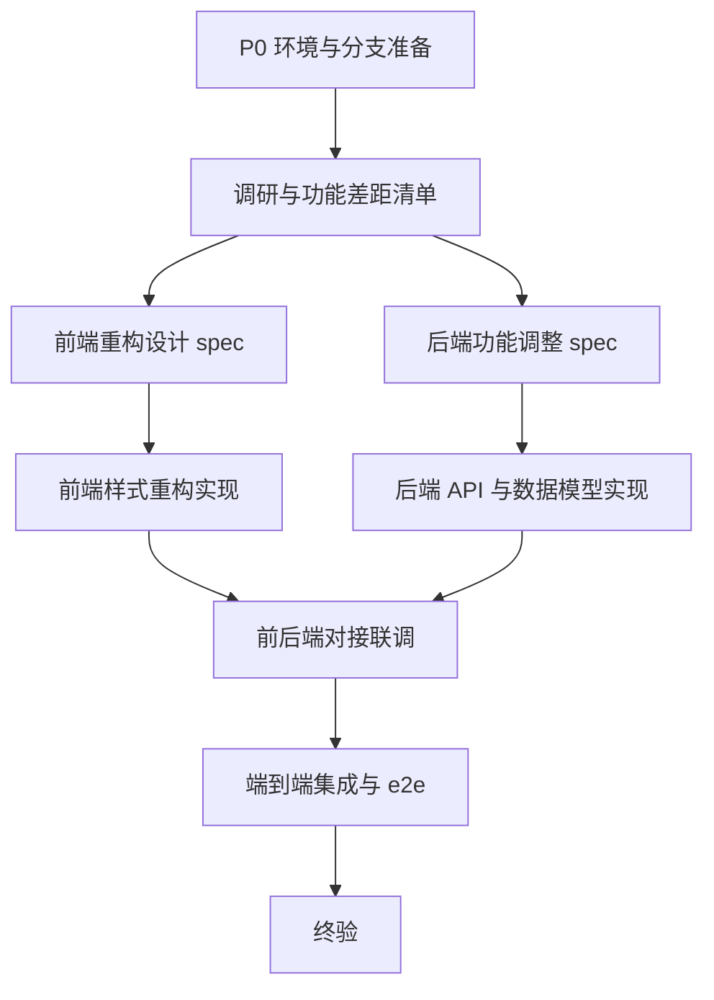

# 风格示例（非真实任务）

> 本文件展示生成文档的**书面风格**：表格化、checkbox 门禁、伪代码主控循环、编号红线。内容是假想任务「订单导出模块交付」，仅用于示范写法，切勿作为真实任务的执行依据。

---

## 示例一：loop 形态（序贯任务）

````markdown
# 订单导出模块交付 · 交付loop执行设计

> 本文档为唯一执行依据。执行者必须按阶段门禁（P0→P5）顺序推进，所有循环仅在满足对应退出条件后方可进入下一阶段；**全任务仅在「第五章 DoD」全部满足后才允许退出主循环**。AGENTS.md 为本任务最高约束，任何产出与之冲突即判定不合格。

## 0. 执行框架总览

### 0.1 目标

为订单模块新增 Excel 导出功能（含导出任务队列与历史记录），前后端完整落地。

### 0.2 主控循环（Master Loop）

```text
初始化进度文件
while DoD 未全部满足:
    定位当前阶段（依据进度文件）
    执行当前阶段任务
    校验该阶段出口门禁
    ├─ 通过 → 推进下一阶段，更新进度文件
    ├─ 未通过 → 进入该阶段内部修复循环（见第六章）
    └─ 修复循环超限 → 升级用户决策（附问题清单与当前状态）
全部门禁通过 → 生成终验报告 → 退出
```

### 0.3 产物索引

| 产物 | 路径 |
| --- | --- |
| 实现 spec | `/docs/specs/{date}-order-export-spec.md` |
| 执行进度文件 | `/docs/progress/{date}-order-export-progress.md` |
| 终验报告 | `/docs/progress/{date}-order-export-final-verification.md` |

### 0.4 阶段门禁总表

| 阶段 | 名称 | 核心产物 | 出口门禁 |
| --- | --- | --- | --- |
| P0 | 环境与分支准备 | feature 分支 + 进度文件 | 分支创建成功；基线已记录 |
| P1 | 需求确认与设计 | 实现 spec | spec 定稿；每项需求有落点 |
| P2 | TDD 实现 | 代码 + 测试 | 任务清单 100% 完成；全量测试通过 |
| P3 | 端到端验收 | e2e 测试报告 | e2e 全绿；边界用例覆盖 |
| P4 | 审核与合入 | PR | code-review 通过；CI 全绿；已合入 |
| P5 | 终验 | 终验报告 | DoD 全部勾选且附证据 |

## 1. 任务范围定义

### 1.1 范围内（In Scope）

1. 导出任务创建接口与异步队列
2. 导出历史记录查询页面
3. Excel 文件生成与下载

### 1.2 范围外（Out of Scope）

1. 导出模板自定义（后续迭代）
2. 报表可视化

## 2. 全局执行总则

1. **阶段门禁制**：严格顺序推进，未满足出口门禁禁止进入下一阶段；回退记录进进度文件
2. **信息获取决策链**（严格按优先级，不得跳级）：
   - L1 项目内部：源代码、AGENTS.md、README、已有测试、git 历史
   - L2 外部信息：框架官方文档、行业最佳实践
   - L3 用户决策：L1/L2 仍无法满足时，一次性汇总全部待决策问题（含背景、可选项、建议方案）
3. **循环收敛**：所有修复类循环设最大迭代次数，超限升级用户，禁止无限循环或静默放弃
4. **单一事实源**：P1 锁定后的 spec 为实现唯一依据，发现规格缺陷必须先回改 spec 再继续
5. **状态续传**：每完成一个任务或通过一个门禁，立即更新进度文件；会话中断后从进度文件恢复
6. **可验证完成**：任何「完成」声明必须附可验证证据（测试输出、命令结果、文件路径）
7. **subagent 执行制**：调研、实现、审核一律派遣 subagent；主控仅编排（进度/门禁/派遣/升级），不亲自执行

## 3. 阶段详细定义

### P2 TDD 实现

**步骤**：

1. 按 WBS 顺序逐任务执行 RED→GREEN→REFACTOR
2. 每任务完成 lint + typecheck + 单测
3. 勾选进度文件并记录 commit（Conventional Commits）

**核心产物**：`src/` 后端实现、`frontend/src/` 前端实现、测试文件

**出口门禁**：

- [ ] 任务清单 100% 勾选
- [ ] 全量测试套件通过（输出附于进度文件）

……（其余阶段同理）

## 4. 协作与派遣规范

```text
【角色】调研专员 / 实现专员 / 审核专员（明确单一职责）
【输入】具体文件路径 / 报告路径 / 上下文说明（禁止模糊指代）
【职责】做什么、不做什么（明确边界）
【输出】产物路径 + 必含内容结构
【完成标准】可验证的退出条件
```

**并行规则**：无依赖的派遣并行执行，有依赖的严格顺序。

## 5. 完成条件（Definition of Done）

- [ ] 导出功能全链路可端到端跑通（接口 → 队列 → 文件生成 → 下载）
- [ ] e2e 覆盖导出成功、空数据、超大数据量、并发重复提交
- [ ] 测试流程全部通过（单测、集成、e2e）
- [ ] CI 流程全绿
- [ ] code-review 审核通过；PR 已合入 dev
- [ ] 全部产物文档已提交 git；终验报告每项附证据

## 6. 循环与中止机制汇总

| 循环 | 触发条件 | 动作 | 退出条件 | 最大迭代 | 超限处理 |
| --- | --- | --- | --- | --- | --- |
| P2 任务修复循环 | 单任务测试失败 | 定位问题→修复→补测试→复跑 | 该任务验收标准达成 | 3 | 升级用户决策 |
| P4 审核修复循环 | review/CI 不通过 | 修复→push→CI 重跑→重审 | review 通过 + CI 绿 | 5 | 升级用户决策 |
| 终验循环 | DoD 未全满足 | 回退责任阶段修复 | DoD 全满足 | 3 | 升级用户决策 |

**中止条件**：删除数据、发布对外等不可逆动作执行前必须先向用户确认；任何循环超限必须升级用户（附问题清单与建议方案），禁止静默放弃或伪造证据。

## 7. 红线禁止事项

1. 禁止跳过任何阶段门禁，或在出口条件未满足时推进下一阶段
2. 禁止未经测试验证即标记任务或阶段完成
3. 禁止在 spec 锁定后偏离实现（发现规格问题必须先回改 spec）
4. 禁止绕过 code-review 直接合入代码
5. 禁止缩小任务范围、削减功能项或边界测试以换取「完成」
6. 禁止伪造、跳过或选择性运行测试与 CI
7. 禁止在 L1/L2 可调研的情况下直接询问用户
8. 禁止丢弃或重做已完成且有进度记录的阶段
9. 禁止产物仅存于对话上下文而不落盘提交
````

---

## 示例二：graph 形态要点（并行任务）

graph 形态在主控循环之外，额外具备以下结构（假想任务：C端重构 + B端后台 + 前后端对接）：

````markdown
### 0.5 节点依赖图



**并行分支**：N3 与 N4 相互独立可并行派遣；N5 与 N6 在各自 spec 锁定后并行实现。
**汇合门禁**：N7 要求 N5、N6 各自出口门禁全部满足且对接契约双方一致。
**回退边**：N7 发现契约不一致 → 回退 N3/N4 修订 spec（版本号 +1）→ 重走受影响节点。
````

## 风格要点小结

1. 总览先行：目标、主控循环、产物索引、门禁总表四件套放最前面，执行者一眼看清全局
2. 一切可验证：门禁与 DoD 全部 checkbox + 证据要求，禁止「差不多」
3. 循环五要素齐全：触发条件 / 动作 / 退出条件 / 最大迭代 / 超限处理
4. 红线编号清单收尾，覆盖「伪造、跳过、绕过、缩减」四类典型作弊路径
5. subagent 执行制：调研/实现/审核必须派遣，主控只做编排与门禁判定
6. graph 形态必须画依赖图并明确并行分支、汇合门禁、回退边
7. 需求模式文档含 1.3 拆分依据节；定项模式仅一行声明「一份 spec = 一个任务」，不再拆分
